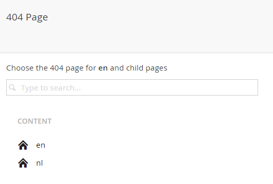

# Umbraco Page Not Found Manager #

----------

**Easy 404 pages for Umbraco**

Please be aware of the [License Model](https://github.com/TimGeyssens/UmbracoPageNotFoundManager/blob/master/License.md) before using this package since additional charges might apply if you are an Umbraco Gold Partner. And it is prohibited to use the Software on the Cloud offering of Umbraco.

Adds a new context menu item to Umbraco content items (for admins only) where you can easily manage your site's 404 page(s).

If you want to use the package on an Umbraco Cloud environment, please get in touch with umbpackages@nibble.be

### Installation

1. [**NuGet Package**][NuGetPackageUrl]  
Install the NuGet package in your Visual Studio project. Makes updating easy.

2. [**Umbraco package**][UmbracoPackageUrl]  
Install the Umbraco package via the developer section in Umbraco.

[NuGetPackageUrl]: https://www.nuget.org/packages/Nibble.Umbraco.PageNotFoundManager/
[UmbracoPackageUrl]: https://our.umbraco.org/projects/backoffice-extensions/umbraco-page-not-found-manager/
